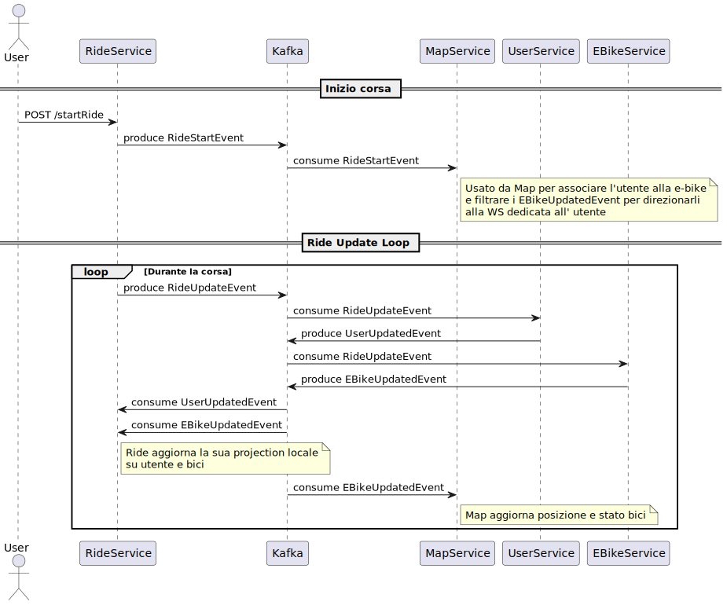

== Package P-1: Microservizi Event-Driven

Il package P-1 rappresenta il nucleo centrale del progetto, fornendo un'implementazione completa dell'applicazione E-Bike tramite un'architettura basata su microservizi event-driven. La soluzione si basa sulla soluzione proposta dell'https://github.com/TonelliLuca/SAP-ass-02[Assignment 02].

=== Visione Architetturale

L'architettura si basa sulla comunicazione asincrona tra microservizi tramite eventi, con Apache Kafka utilizzato come broker centrale. Ogni microservizio è stato progettato secondo il principio del *single writer*: ciascun servizio produce gli eventi relativi al proprio dominio, diventando così la fonte di verità per quell’ambito e semplificando la gestione della consistenza e della tracciabilità degli stati nel sistema.

Per la definizione e l’evoluzione degli eventi, sono stati adottati Apache Avro e Confluent Schema Registry, così che ogni evento scambiato su Kafka rispetti uno schema esplicito e condiviso, mantenendo compatibilità tra servizi anche in caso di evoluzione futura dei dati. L’approccio garantisce che producer e consumer siano sempre allineati sul significato e la struttura delle informazioni trasmesse.

Dal punto di vista della struttura interna, ogni microservizio segue un ciclo preciso: riceve eventi da Kafka, li elabora applicando la propria logica di business, aggiorna lo stato locale e, quando necessario, pubblica nuovi eventi verso gli altri servizi. Questo pattern permette a ciascun componente di essere autonomo ma coordinato con il resto del sistema, mantenendo basso l’accoppiamento tra le parti.

Vert.x è stato mantenuto come framework principale sia per la gestione delle API REST (sincrone), sia per health check, caricamento configurazioni tramite variabili d’ambiente, interazione con MongoDB e gestione dell’event bus interno di alcuni servizi. In questo modo si differenzia chiaramente il canale delle chiamate API (esterne/sincrone) dalla comunicazione asincrona (interna/eventi).

Per il monitoraggio del sistema è stata mantenuta l’integrazione con Prometheus, che consente di raccogliere metriche in tempo reale da tutti i microservizi e agevola l’analisi delle performance o l’individuazione di anomalie operative. Completano l’architettura l’API Gateway (punto di accesso centralizzato) e il Service Discovery (Eureka), che garantisce la registrazione e scoperta dinamica dei servizi all’interno del sistema distribuito.

=== Dettaglio dei microservizi

Ogni microservizio è stato adattato a una logica event driven, definendo una serie di eventi di dominio gestiti nell'application layer.

==== EBike Microservice

Il microservizio EBike rappresenta un componente fondamentale nell'architettura event-driven complessiva, responsabile della gestione del ciclo di vita delle biciclette elettriche nel sistema.

===== Approccio Event-Driven

Il microservizio implementa un approccio event-driven puro:

* **Stato persistente**: Mantiene lo stato attuale delle e-bike nel repository MongoDB
* **Comunicazione asincrona**: Utilizza eventi per notificare altri servizi di cambiamenti di stato
* **Reazioni agli eventi**: Aggiorna lo stato delle e-bike in base agli eventi ricevuti dai noleggi

Questo approccio permette al servizio di mantenere una fonte di verità per lo stato delle e-bike, comunicando efficacemente ogni cambiamento agli altri microservizi interessati.

===== Modello a Eventi

Il microservizio utilizza diversi tipi di eventi immutabili:

* `EBikeCreateEvent`: Segnala l'aggiunta di una nuova e-bike al sistema
* `EBikeUpdateEvent`: Notifica cambiamenti nello stato di un'e-bike esistente
* `EBikeRechargeEvent`: Comunica la richiesta di ricarica di una specifica e-bike
* `RequestEBikeUpdateEvent`: Trasporta richieste di aggiornamento dei dati di un'e-bike

Tutti gli eventi implementano l'interfaccia `Event` e sono definiti come `record` Java immutabili, garantendo integrità e consistenza nei dati trasmessi.

===== Interfacce di Comunicazione

Il microservizio espone due modalità di interazione:

1. **API REST (sincrone)** tramite `RESTEBikeAdapter` che espone endpoint per:
   * Creazione di e-bike (`POST /api/ebikes/create`)
   * Ricarica di e-bike (`PUT /api/ebikes/:id/recharge`)
   * Recupero di tutte le e-bike (`GET /api/ebikes`)

2. **Comunicazione asincrona con Kafka**:
   * **Consumer**: Tramite `RideUpdatesConsumer` che ascolta gli eventi `RideUpdateEventAvro` dal topic "ride-events"
   * **Producer**: Pubblica eventi di aggiornamento attraverso `EbikeUpdatesProducer` sul topic "ebike-events"

===== Flusso Operativo

Per ogni operazione, il microservizio:

1. **Ricezione input**: Tramite REST o eventi Kafka
2. **Elaborazione**: `EBikeServiceImpl` processa le richieste applicando la logica di business
3. **Persistenza**: Lo stato attuale delle e-bike viene mantenuto nel repository
4. **Pubblicazione eventi**: Dopo ogni cambiamento di stato, viene pubblicato un `EBikeUpdateEvent` su Kafka per informare gli altri servizi

All'avvio, il servizio carica tutte le e-bike dal repository e pubblica eventi di aggiornamento per sincronizzare gli altri componenti del sistema.

==== User Microservice

Il microservizio User rappresenta un'implementazione completa del pattern Event Sourcing all'interno dell'architettura, gestendo tutte le informazioni e le operazioni relative agli utenti del sistema.

===== Event Sourcing Implementation

A differenza del microservizio EBike, che utilizza un approccio event-driven ma mantiene lo stato corrente, il microservizio User adotta pienamente il pattern Event Sourcing:

* **Persistenza eventi**: Ogni modifica allo stato di un utente viene salvata come evento immutabile nell'event store (MongoDB)
* **Ricostruzione stato**: Lo stato corrente di un utente non è mai salvato direttamente, ma viene sempre ricostruito dalla sequenza degli eventi storici
* **Completa tracciabilità**: La cronologia completa di ogni utente è disponibile per audit, debugging e analisi

Il metodo `rebuildUserState` in `UserServiceImpl` è il cuore dell'implementazione, ricostruendo lo stato attuale dell'utente processando in sequenza temporale tutti gli eventi associati.

===== Modello a Eventi

Il microservizio utilizza diversi tipi di eventi immutabili:

* `UserCreatedEvent`: Registra la creazione di un nuovo utente nel sistema
* `UserSignInEvent`: Traccia gli accessi degli utenti
* `UserUpdateEvent`: Cattura modifiche allo stato dell'utente (tipo, credito)
* `RechargeCreditEvent`: Registra le operazioni di ricarica del credito
* `RequestUserUpdateEvent`: Veicola richieste di aggiornamento provenienti da altri servizi

Tutti gli eventi implementano l'interfaccia `Event` e sono definiti come `record` Java, garantendo immutabilità e consistenza.

===== Interfacce di Comunicazione

Il microservizio espone due modalità di interazione:

1. **API REST (sincrone)** tramite `RESTUserAdapter`:
  * Registrazione utente (`POST /api/users/signup`)
  * Accesso utente (`POST /api/users/signin`)
  * Ricarica credito (`PATCH /api/users/:username/recharge`)
  * Osservazione utenti tramite WebSocket (`/observeAllUsers`, `/observeUser/:username`)

2. **Comunicazione asincrona con Kafka**:
  * **Consumer**: `RideUpdatesConsumer` ascolta il topic "ride-events" per aggiornare il credito degli utenti
  * **Producer**: Pubblica eventi di aggiornamento attraverso `UserUpdatesProducer` sul topic "user-events"

===== Flusso Event Sourcing

Per ogni operazione, il microservizio:

1. **Ricezione input**: Da API REST o eventi Kafka
2. **Recupero eventi**: Ottiene tutti gli eventi storici relativi all'utente
3. **Ricostruzione stato**: Applica sequenzialmente gli eventi per ottenere lo stato corrente
4. **Valutazione comando**: Verifica la fattibilità dell'operazione richiesta
5. **Generazione evento**: Crea un nuovo evento che rappresenta l'operazione
6. **Persistenza evento**: Salva l'evento nell'event store
7. **Pubblicazione**: Notifica altri servizi tramite Kafka e WebSocket

Questo approccio garantisce consistenza, tracciabilità completa e la possibilità di "time travel" attraverso la storia di ogni utente.

All'avvio, il servizio ricostruisce lo stato di tutti gli utenti dai loro eventi e pubblica eventi di aggiornamento per sincronizzare gli altri microservizi.

==== Ride Microservice

Il microservizio Ride rappresenta un componente fondamentale nell'architettura event-driven complessiva, responsabile della gestione del noleggio di e-bike da parte degli utenti e della simulazione in tempo reale delle corse.

===== Approccio a Proiezioni Locali

Il microservizio implementa un approccio interessante che combina elementi event-driven con proiezioni locali:

* **Event-driven**: Utilizza eventi per comunicare con altri servizi e gestire il ciclo di vita dei noleggi
* **Proiezioni locali**: Mantiene copie locali degli stati di utenti ed e-bike attraverso il `LocalProjectionRepository`
* **Simulazione eventi**: Genera eventi in tempo reale durante il noleggio tramite `RideSimulation` e `EventPublisher`

Questo approccio permette al servizio di reagire rapidamente alle richieste degli utenti senza dover interrogare continuamente gli altri microservizi, mantenendo una cache locale degli stati più recenti ricostruiti dagli eventi ricevuti.

===== Modello a Eventi

Il microservizio utilizza diversi tipi di eventi immutabili:

* `RideStartEvent`: Registra l'inizio di un noleggio, associando un utente a una e-bike
* `RideStopEvent`: Segnala la conclusione di un noleggio, liberando l'e-bike
* `RideUpdateEvent`: Comunica aggiornamenti continui durante la simulazione (posizione, batteria, credito)
* `RequestRideEndEvent`: Veicola richieste di terminazione anticipata di un noleggio

Parallelamente, il servizio consuma e memorizza eventi provenienti da altri domini:
* `UserUpdateEvent`: Eventi relativi agli utenti ricevuti dal topic "user-events"
* `EBikeUpdateEvent`: Eventi relativi alle e-bike ricevuti dal topic "ebike-events"

Tutti gli eventi sono implementati come `record` Java immutabili, garantendo integrità e tracciabilità delle operazioni.

===== Interfacce di Comunicazione

Il microservizio espone due modalità di interazione:

1. **API REST (sincrone)** tramite `RideServiceVerticle`:
   * Avvio noleggio (`POST /startRide`)
   * Terminazione noleggio (`POST /stopRide`)
   * Health check (`GET /health`) e metriche (`GET /metrics`)

2. **Comunicazione asincrona con Kafka**:
   * **Consumer**: Riceve aggiornamenti sugli utenti e le e-bike tramite `ProjectionUpdatesConsumer`
   * **Producer**: Pubblica eventi di noleggio attraverso `RideEventsProducer`

===== Flusso Operativo

Il flusso di lavoro del servizio segue questo pattern:

1. **Ricezione richiesta**: Tramite REST o eventi
2. **Consultazione proiezioni**: Verifica dello stato attuale di utenti ed e-bike dalle proiezioni locali
3. **Validazione business rules**: Controllo di disponibilità dell'e-bike, credito sufficiente e livello batteria
4. **Creazione noleggio**: Inizializzazione di un oggetto `Ride` e avvio della simulazione
5. **Pubblicazione eventi**: Notifica agli altri servizi tramite eventi Kafka

La simulazione di una corsa, come nell'implementazione base:
* Aggiorna continuamente la posizione dell'e-bike secondo un algoritmo di movimento
* Riduce progressivamente il credito dell'utente e la batteria dell'e-bike
* Pubblica eventi `RideUpdateEvent` ad ogni aggiornamento tramite `EventPublisher`
* Termina automaticamente quando la batteria o il credito raggiungono zero

All'avvio, il servizio si registra con Eureka per il service discovery e inizia ad ascoltare gli eventi da Kafka, costruendo progressivamente le sue proiezioni locali per utenti ed e-bike.

==== Map Microservice

Il microservizio Map, già presente nella precedente versione dell'architettura, ha richiesto solo adattamenti minimali per integrarsi nel nuovo sistema event-driven. In particolare, è stato implementato il componente RideUpdatesConsumer che permette al servizio di reagire in tempo reale agli eventi generati dagli altri microservizi.

Questo consumer si sottoscrive a due topic Kafka fondamentali:

ride-events: per tracciare inizio e fine dei noleggi
ebike-events: per aggiornare la posizione e lo stato delle biciclette
Quando riceve un evento, il consumer lo processa e aggiorna la visualizzazione grafica della mappa di conseguenza, mostrando in tempo reale la posizione delle e-bike con differenti colori in base al loro stato operativo.

=== Scelte architetturali e organizzazione dei topic Kafka

Nel disegno dei topic Kafka, si è seguito un criterio di coerenza con i bounded context del dominio, evitando topic troppo generici. Ogni topic è stato progettato per raccogliere eventi di una singola tipologia logica, in modo che i consumatori possano sottoscriversi solo ai flussi rilevanti e interpretare con chiarezza la semantica degli eventi ricevuti.

Nello specifico:

- Il topic `ride-events` veicola esclusivamente eventi relativi al ciclo di vita dei noleggi (inizio, aggiornamento, fine corsa).
- Il topic `ebike-events` raccoglie eventi di aggiornamento delle biciclette elettriche.
- Il topic `user-events` è dedicato agli aggiornamenti di stato degli utenti.

Questa organizzazione dei topic facilita la **gestione della single source of truth** (ogni servizio produce eventi solo sul proprio topic di riferimento), consente la scalabilità indipendente dei consumer per ogni flusso e rende semplice evolvere gli schemi degli eventi con Avro senza impattare altri domini.

==== Flusso di propagazione e validazione degli eventi
.Lista dei topic e definizione dei consumer/producer
image::../resources/svg/p-1-topic.svg[Lista dei topic e interazione con microservizi, width=600]

Nel ciclo di vita di una corsa, i microservizi non comunicano tramite invocazioni dirette, ma esclusivamente attraverso eventi Kafka, mantenendo un disaccoppiamento logico tra le componenti.

Il microservizio Ride ha il compito di gestire la logica di simulazione della corsa: al momento dell'avvio (`startRide`) o durante l'esecuzione (`updateRide`), esso produce eventi (`RideStartedEvent`, `RideUpdateEvent`) che contengono informazioni come la bici utilizzata, l’utente coinvolto, la posizione, il tempo e i consumi stimati.

Tuttavia, questi eventi non modificano direttamente lo stato effettivo delle entità coinvolte (come la disponibilità di una bici o il credito di un utente). Invece, tali eventi vengono **consumati dai microservizi EBike e User**, che:

- Valutano il contenuto dell’evento secondo le proprie regole di business (es. controllo sul credito residuo o sul livello di batteria),
- Decidono autonomamente se accettare l’azione proposta,
- E, solo in caso di esito positivo, producono un proprio evento (`EBikeUpdatedEvent`, `UserUpdatedEvent`) che rappresenta la modifica effettiva dello stato interno.

Questo meccanismo garantisce che ogni microservizio resti l’unico responsabile dello stato che gestisce, evitando conflitti e mantenendo la coerenza dei dati. Ad esempio:

- È **EBikeService**, e non Ride, a decidere se una bici può essere assegnata e a comunicarne la nuova disponibilità.
- È **UserService**, e non Ride, a calcolare e registrare la diminuzione del credito utente.

Gli eventi `RideUpdateEvent` prodotti da Ride fungono quindi da **richiesta**, ma la modifica reale dello stato avviene solo in risposta alla validazione interna da parte del microservizio destinatario. In questo modo, la sincronizzazione dello stato tra i vari microservizi avviene in maniera affidabile, tracciabile e coerente.

I servizi di supporto come Map consumano infine gli eventi di aggiornamento (`ride-events`, `ebike-events`) per aggiornare le proiezioni grafiche o informative, senza avere alcuna autorità sui dati stessi, gli aggiornamenti relativi all'utente invece, vengono notificati alla gui tramite le web socket interne al microservizio user come da previa implementazione.

.Diagramma di sequenza che rappresenta il ciclo di eventi prodotti da una ride

===== Serializzazione e validazione degli eventi con Apache Avro e Schema Registry

All'interno del sistema, la serializzazione e la validazione degli eventi tra microservizi si basano sull'utilizzo congiunto di **Apache Avro** e **Confluent Schema Registry**. Questa combinazione consente di garantire messaggi binari compatti, schema-based, validati automaticamente sia lato producer che consumer.

Confluent Schema Registry è stato integrato nel sistema tramite container Docker dedicato, configurato all'interno del `docker-compose.yml` per comunicare con Kafka:

[source,yaml]
----
schema-registry:
  image: confluentinc/cp-schema-registry:7.9.1
  ports:
    - "${SCHEMA_REGISTRY_HOST_PORT}:8081"
  environment:
    - SCHEMA_REGISTRY_KAFKASTORE_BOOTSTRAP_SERVERS=PLAINTEXT://kafka:29092
    - SCHEMA_REGISTRY_HOST_NAME=schema-registry
    - SCHEMA_REGISTRY_LISTENERS=http://0.0.0.0:8081
----

Lo Schema Registry mantiene un registro centralizzato di tutti gli schemi `.avsc` utilizzati nel sistema, assegnando a ciascuno un identificatore univoco. In questo modo, i messaggi Kafka trasportano solo l'ID dello schema e non l'intera definizione, ottimizzando le performance e garantendo la validazione automatica e la compatibilità evolutiva.

Gli eventi sono modellati come record Avro, che possono contenere campi primitivi oppure record annidati. Ogni producer riceve una serie di eventi di dominio, che successivamente vengono mappati in uno schema avro specifico e inviati. La definizione di uno schema tipico prevede:

- Il tipo principale `record`
- Un nome simbolico identificativo
- Un namespace coerente con il dominio applicativo
- Timestamp e UUID dell'evento
- Un array di `fields`, ciascuno con nome e tipo

.Esempio generico di schema Avro
[source,json]
----
{
  "type": "record",
  "name": "SomeDomainEvent",
  "namespace": "events.avro",
  "fields": [
    {"name": "id", "type": "string"},
    {"name": "timestamp", "type": "string"},
    {"name": "payload", "type": {
      "type": "record",
      "name": "Entity",
      "fields": [
        {"name": "id", "type": "string"},
        {"name": "status", "type": "string"},
        {"name": "value", "type": "int"}
      ]
    }}
  ]
}
----

Questa struttura permette di definire eventi ricchi e auto-descrittivi, mantenendo un contratto formale tra i servizi che li scambiano.

In alcuni topic Kafka vengono trasmessi più tipi di eventi appartenenti a uno stesso dominio. Per gestirli con un unico schema, è stato adottato il pattern **Union Type** di Avro.

Si definisce un record contenitore che include un campo `payload`, il cui tipo è una unione di più tipi concreti.

.Esempio generico di schema Union
[source,json]
----
{
  "type": "record",
  "name": "DomainEventUnion",
  "namespace": "events.avro",
  "fields": [
    {
      "name": "payload",
      "type": [
        "events.avro.EventTypeA",
        "events.avro.EventTypeB",
        "events.avro.EventTypeC"
      ]
    }
  ]
}
----

Questo approccio consente:
- di trasmettere più eventi logicamente affini in un singolo topic;
- di evitare la proliferazione di topic distinti;
- di mantenere coerenza e validazione schema-based.

Lato consumer, il record Avro ricevuto viene deserializzato come `GenericRecord`. Poiché il campo `payload` è una union, è necessario **identificare il tipo specifico dell’evento ricevuto** tramite il nome dello schema.

Il consumer può quindi applicare un filtro e processare solo i tipi rilevanti per il proprio dominio.

.Esempio generico di codice di consumo filtrato
[source,java]
----
private void processEvent(String key, GenericRecord event) {
    String schemaName = event.getSchema().getName();
    if (!"EventTypeB".equals(schemaName)) {
        logger.debug("Evento ignorato: {}", schemaName);
        return;
    }

    // Elaborazione dell'evento di interesse
    String id = event.get("id").toString();
    GenericRecord payload = (GenericRecord) event.get("payload");
    String status = payload.get("status").toString();

    // Logica applicativa...
}
----

Questa tecnica permette di mantenere consumer generici, ma configurabili per gestire **solo gli eventi significativi**.

