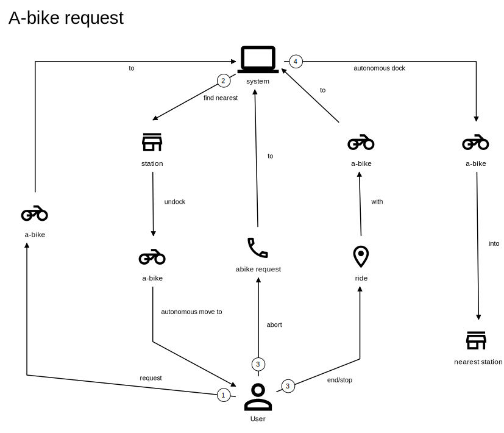
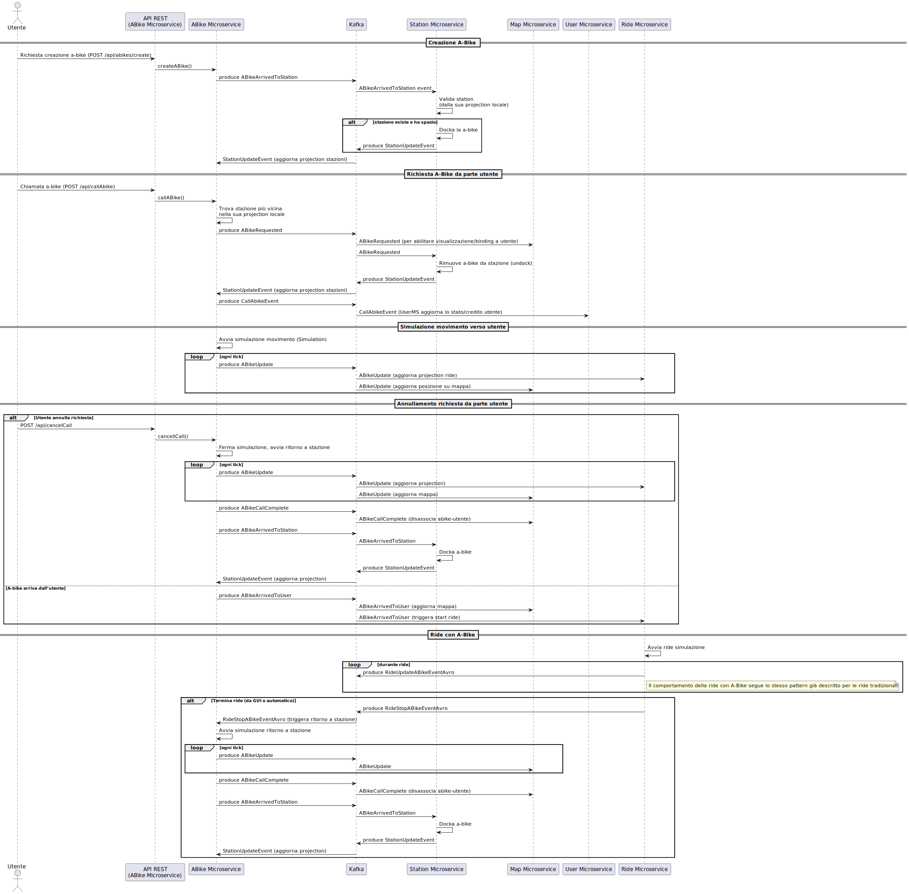

== Package P-3: Introduzione di A-Bike, Station e Digital Twin

=== Estensione del Domain-Driven Design: A-Bike, Station e Digital Twin

Per rispondere alle nuove richieste progettuali introdotte nella terza parte dell’elaborato, si è reso necessario estendere il Domain-Driven Design sviluppato nel progetto originale. In particolare, vengono introdotti i concetti di bicicletta autonoma (a-bike), stazione (station) e digital twin urbano, al fine di supportare scenari avanzati di mobilità autonoma all’interno di un contesto smart city.

==== Obiettivi e requisiti dell'estensione

Gli obiettivi definiti dall’elaborato sono i seguenti:

- Introdurre una nuova tipologia sperimentale di bicicletta, la **a-bike** (bicicletta autonoma), in grado di:
* Raggiungere autonomamente la stazione più vicina dopo essere stata utilizzata;
* Raggiungere autonomamente la posizione dell’utente che ne richiede il servizio.
- Integrare le a-bike in un ambiente di smart city, sfruttando una componente di **digital twin** che:
* Mantenga una rappresentazione virtuale aggiornata dello stato delle biciclette e delle stazioni;

==== Estensione dell'Ubiquitous Language

[cols="1,3", options="header"]
|===
| Termine      | Descrizione

| A-Bike      | Bicicletta elettrica autonoma, dotata di capacità di movimento automatico, in grado di raggiungere la stazione più vicina dopo l'utilizzo e di muoversi verso l’utente che ne richiede il servizio.
| Stazione    | Punto fisico all’interno della città dove le a-bike possono essere parcheggiate e ricaricate. Ogni stazione gestisce la propria capacità disponibile.
| Digital Twin| Gemello digitale della città: una rappresentazione virtuale aggiornata in tempo reale di biciclette e stazioni che fornisce servizi di supporto e monitoraggio.
|===

==== Requisiti Funzionali Estesi per A-Bike, Station e Digital Twin

1. Il sistema deve permettere agli utenti di richiedere una a-bike tramite l’interfaccia grafica, così che una bicicletta autonoma si diriga automaticamente verso la loro posizione.
2. Il sistema deve permettere agli utenti di annullare una richiesta di a-bike già inviata; in tal caso, la a-bike deve tornare autonomamente alla stazione più vicina disponibile.
3. Il sistema deve permettere agli utenti di visualizzare tramite l’interfaccia grafica tutte le stazioni e monitorarne la disponibilità in tempo reale.
4. Il sistema deve permettere agli utenti di seguire, sempre tramite interfaccia grafica, l’intero ciclo della a-bike richiesta, dalla partenza verso l’utente, durante la corsa e fino al ritorno in stazione.
5. Il sistema deve permettere alle a-bike di raggiungere autonomamente la stazione più vicina al termine di ogni corsa.
6. Il sistema deve permettere agli utenti amministratori di creare nuove stazioni all’interno dell’ambiente.
7. Il sistema deve permettere agli utenti amministratori di aggiungere nuove a-bike e di assegnarle a una stazione specifica.
8. Il sistema deve permettere alla componente Digital Twin di mantenere una vista aggiornata e coerente della posizione e dello stato di tutte le a-bike e delle stazioni.

==== User Story

[cols="1,3", options="header"]
|===
| User Story | Descrizione

| US12: Richiesta A-Bike
| *Given* un utente autenticato

*When* l’utente richiede una a-bike tramite l’interfaccia grafica

*Then* il sistema seleziona la a-bike disponibile più vicina e la fa muovere automaticamente verso la posizione dell’utente

| US13: Annullamento richiesta A-Bike
| *Given* un utente che ha richiesto una a-bike

*When* l’utente annulla la richiesta prima che la corsa inizi

*Then* la a-bike torna autonomamente alla stazione più vicina disponibile

| US14: Monitoraggio A-Bike e Stazioni
| *Given* un utente che ha richiesto una a-bike

*When* la a-bike è in movimento verso l’utente, durante la corsa, e al termine della stessa

*Then* l’utente può seguire graficamente su mappa lo spostamento della bici, la corsa e il ritorno in stazione, e può visualizzare lo stato e la disponibilità delle stazioni in tempo reale

| US15: Docking Automatico
| *Given* una a-bike che termina una corsa

*When* la corsa viene conclusa

*Then* la a-bike si dirige e parcheggia autonomamente presso la stazione più vicina con slot disponibile

| US16: Creazione Stazione (Admin)
| *Given* un utente amministratore

*When* l’amministratore accede alla sezione di gestione delle stazioni

*Then* può creare una nuova stazione indicando posizione e capacità

| US17: Aggiunta A-Bike (Admin)
| *Given* un utente amministratore

*When* l’amministratore accede alla sezione di gestione delle a-bike

*Then* può aggiungere una nuova a-bike e assegnarla a una stazione specifica

| US18: Monitoraggio tramite Digital Twin (Admin)
| *Given* un amministratore

*When* accede all’interfaccia di Digital Twin

*Then* può visualizzare in tempo reale lo stato, la posizione e la disponibilità di tutte le a-bike e delle stazioni
|===

=== Use-Case diagrams

.Use-case diagram relativo agli utenti
image::../resources/svg/usecase-user-sap.drawio.svg[Use-case diagram relativo agli utenti, width=30%, height=30%]

[cols="1,5", options="header"]
|===
| Campo | Descrizione

| Use Case
| Richiedere a-bike

| Attori
| Utente

| Scope
| Applicazione Smart City

| Livello
| Alto

| Precondizioni
| L’utente è autenticato e ha credito sufficiente; esiste almeno una a-bike disponibile

| Postcondizioni
| Una a-bike viene inviata verso la posizione dell’utente; la richiesta è tracciata nel sistema

| Trigger
| L’utente seleziona “Richiedi a-bike” nell’interfaccia grafica

| Flusso
|
. L’utente seleziona l’opzione per richiedere una a-bike

. Il sistema individua la a-bike disponibile più vicina

. Il sistema comanda la a-bike a muoversi verso l’utente

. L’utente può monitorare lo stato della richiesta tramite la GUI
|===

[cols="1,5", options="header"]
|===
| Campo | Descrizione

| Use Case
| Annullare richiesta a-bike

| Attori
| Utente

| Scope
| Applicazione Smart City

| Livello
| Alto

| Precondizioni
| Esiste una richiesta di a-bike in corso non ancora conclusa

| Postcondizioni
| La richiesta viene annullata; la a-bike torna autonomamente alla stazione più vicina disponibile

| Trigger
| L’utente seleziona “Annulla richiesta a-bike” nell’interfaccia grafica

| Flusso
|
. L’utente seleziona l’opzione per annullare la richiesta di a-bike

. Il sistema riceve l’annullamento

. La a-bike interrompe il movimento verso l’utente (se non ancora arrivata)

. Il sistema comanda la a-bike a tornare alla stazione disponibile più vicina
|===

[cols="1,5", options="header"]
|===
| Campo | Descrizione

| Use Case
| Monitoraggio stazioni/a-bike via UI

| Attori
| Utente

| Scope
| Applicazione Smart City

| Livello
| Alto

| Precondizioni
| L’utente è autenticato

| Postcondizioni
| L’utente può visualizzare in tempo reale la posizione e la disponibilità delle stazioni e delle a-bike, e seguire lo stato della richiesta

| Trigger
| L’utente effettua il login al sistema

| Flusso
|
. L’utente effettua il login al sistema

. Il sistema mostra le stazioni, la disponibilità di slot e la posizione delle a-bike

. L’utente può seguire l’intero ciclo della a-bike richiesta (avvicinamento, corsa, ritorno in stazione)
|===

[cols="1,5", options="header"]
|===
| Campo | Descrizione

| Use Case
| Aggiunta stazione

| Attori
| Admin

| Scope
| Applicazione Smart City

| Livello
| Medio

| Precondizioni
| L’admin è autenticato

| Postcondizioni
| Una nuova stazione è registrata nel sistema, visibile nella mappa e disponibile per l’assegnazione di a-bike

| Trigger
| L’admin seleziona “Add stazione” nell’interfaccia di amministrazione

| Flusso
|
. L’admin preme il pulsatne "Add stazione"

. Inserisce posizione, capacità e altri dettagli della stazione

. Il sistema salva la nuova stazione e la rende disponibile
|===

[cols="1,5", options="header"]
|===
| Campo | Descrizione

| Use Case
| Aggiunta a-bike

| Attori
| Admin

| Scope
| Applicazione Smart City

| Livello
| Medio

| Precondizioni
| L’admin è autenticato; esiste almeno una stazione a cui assegnare la nuova a-bike

| Postcondizioni
| Una nuova a-bike è aggiunta alla flotta ed è assegnata a una stazione

| Trigger
| L’admin seleziona “Add a-bike” nell’interfaccia di amministrazione

| Flusso
|
. L’admin preme il pulsante "add a-bike"

. Inserisce i dati della nuova a-bike

. Seleziona la stazione di assegnazione

. Il sistema salva la nuova a-bike associandola alla stazione scelta
|===

[cols="1,5", options="header"]
|===
| Campo | Descrizione

| Use Case
| Monitoraggio stazioni/a-bike via Digital Twin

| Attori
| Admin

| Scope
| Applicazione Smart City

| Livello
| Alto

| Precondizioni
| L’admin è autenticato

| Postcondizioni
| L’admin può visualizzare in tempo reale la posizione, lo stato e la disponibilità di tutte le a-bike e delle stazioni tramite la piattaforma Digital Twin

| Trigger
| L’admin accede alla dashboard Digital Twin

| Flusso
|
. L’admin apre la dashboard Digital Twin

. Il sistema mostra una vista aggiornata di tutte le stazioni e delle a-bike

. L’admin può filtrare, ricercare o analizzare lo stato delle risorse
|===

.Use-case diagram relativo alle automazioni di sistema
image::../resources/svg/usecase-system-sap.drawio.svg[Use-case diagram relativo alle automazioni di sistema, width=30%, height=30%]

[cols="1,5", options="header"]
|===
| Campo | Descrizione

| Use Case
| A-bike movimento autonomo verso utente

| Attori
| Sistema

| Scope
| Applicazione Smart City – Automazione

| Livello
| Medio

| Precondizioni
| Il sistema ha ricevuto una richiesta valida di a-bike da parte di un utente

| Postcondizioni
| La a-bike si muove autonomamente verso la posizione dell’utente e aggiorna il suo stato durante il percorso

| Trigger
| Il sistema riceve il comando di muovere la a-bike verso l’utente

| Flusso
|
. Il sistema individua la posizione dell’utente

. Calcola il percorso ottimale

. Comanda la a-bike a spostarsi autonomamente verso l’utente

. Aggiorna in tempo reale la posizione della a-bike
|===

[cols="1,5", options="header"]
|===
| Campo | Descrizione

| Use Case
| A-bike docking autonomo

| Attori
| Sistema

| Scope
| Applicazione Smart City – Automazione

| Livello
| Medio

| Precondizioni
| La corsa con la a-bike è terminata, oppure la richiesta è stata annullata

| Postcondizioni
| La a-bike si dirige autonomamente verso la stazione più vicina con slot disponibile e aggiorna il proprio stato

| Trigger
| Termine corsa o annullamento richiesta

| Flusso
|
. Il sistema rileva la necessità di docking automatico

. Calcola la stazione più vicina disponibile

. Comanda la a-bike a dirigersi autonomamente verso la stazione

. Aggiorna la disponibilità della stazione e la posizione della a-bike
|===

=== Domain storytelling

[.text-center]
====
*Domain Storytelling – Flusso utente per l’utilizzo di una a-bike autonoma*:
Il diagramma rappresenta il percorso tipico di un utente che richiede una a-bike, dal momento della richiesta fino alla conclusione della corsa. Mostra come il sistema individua la stazione più vicina, sgancia la bici, gestisce il movimento autonomo verso l’utente e il ritorno automatico della bici alla stazione al termine della ride o in caso di annullamento.
====

=== Bounded Context

In seguito all’estensione del sistema per supportare le biciclette autonome e la componente Digital Twin, sono stati individuati i seguenti nuovi bounded context:

[cols="1,4", options="header"]
|===
| Bounded Context | Descrizione

| Station Management
| Gestisce le stazioni di parcheggio e ricarica per abike. Mantiene lo stato, la capacità e la disponibilità delle stazioni. Gestisce tutte le operazioni di docking e undocking delle bici e pubblica eventi di aggiornamento ufficiali relativi alle stazioni.

| ABike Management
| Rappresenta il dominio delle biciclette autonome (a-bike). Gestisce il ciclo di vita, il movimento automatico (verso stazione o utente). Mantiene una proiezione locale delle stazioni per ottimizzare le decisioni di mobilità, ma delega sempre la validazione delle operazioni critiche (ad es. undocking) a Station Management.

| Digital Twin Integration
| Adatta e traduce gli eventi di aggiornamento provenienti da ABike Management e Station Management verso la piattaforma Digital Twin (es. Eclipse Ditto), mantenendo una vista digitale e aggiornata della situazione reale del sistema. Questo context funge da adattatore e sincronizzatore tra il sistema event-driven e l’ambiente smart city virtuale.
|===

=== Domain model
In seguito verranno definiti i domain model dei tre context individuati

==== Station Management

*Aggregate Root:*

* _Station_: Rappresenta una stazione fisica dove le a-bike possono essere parcheggiate e ricaricate. Gestisce la propria capacità e mantiene traccia delle biciclette attualmente ancorate.

*Value Objects:*

* _P2d_: Rappresenta un punto bidimensionale (x,y) che definisce la posizione geografica di una stazione.

*Domain Events:*

* _BikeDockedEvent_: Generato quando una a-bike viene ancorata con successo a una stazione.
* _BikeReleasedEvent_: Generato quando una a-bike viene rilasciata da una stazione.
* _CreateStationEvent_: Generato quando una nuova stazione viene creata nel sistema.

*Repository:*

* _StationRepository_: Gestisce la persistenza delle stazioni

==== ABike Management

*Aggregate Root:*

* _ABike_: Rappresenta una bicicletta autonoma con capacità di movimento senza conducente. Mantiene informazioni sulla posizione, livello batteria e stato operativo corrente.

*Value Objects:*

* _P2d_: Rappresenta un punto bidimensionale (x,y) utilizzato per la posizione della bicicletta.
* _ABikeState_: Enumeration che definisce gli stati possibili di una a-bike: AVAILABLE (disponibile), AUTONOMOUS_MOVING (in movimento autonomo), IN_USE (in utilizzo), MAINTENANCE (in manutenzione).
* _Purpose_: Enumeration che definisce lo scopo di un movimento autonomo: TO_USER (verso l'utente) o TO_STATION (verso una stazione).

*Entities:*

* _Destination_: Rappresenta una destinazione con posizione e identificativo, può essere un utente o una stazione.

*Domain Services:*

* _Simulation_: Servizio di dominio che gestisce il movimento autonomo di una a-bike verso una destinazione. Calcola il percorso, aggiorna la posizione e notifica eventi di posizione fino al raggiungimento della meta.

*Domain Events:*

* _ABikeCreateEvent_: Generato quando una nuova a-bike viene creata nel sistema.
* _ABikeUpdate_: Generato quando le proprietà di una a-bike vengono aggiornate (posizione, stato, ecc.).
* _ABikeArrivedToUser_: Generato quando una a-bike raggiunge con successo un utente.
* _ABikeArrivedToStation_: Generato quando una a-bike raggiunge con successo una stazione.
* _CallAbikeEvent_: Generato quando un utente richiede una a-bike.
* _CancellCallRequest_: Generato quando un utente annulla una richiesta di a-bike.
* _ABikeCallComplete_: Generato quando una richiesta di a-bike viene completata.

*Repository:*

* _SimulationRepository_: Gestisce la persistenza delle simulazioni di movimento autonomo

* _ABikeRepository_: Gestisce la persistenza delle abike

*Aggregate Projections:*

* _ABike_: Rappresentazione locale dell'aggregato ABike, contenente identificativo, posizione, livello batteria e stato operativo.
* _Station_: Rappresentazione locale dell'aggregato Station, con informazioni su posizione, capacità e biciclette attualmente ancorate.

*Value Objects:*

* _Location_: Rappresenta un punto bidimensionale (x,y) utilizzato per definire la posizione di a-bike e stazioni.

*Domain Events:*

* _ABikeUpdateEvent_: Evento che trasporta aggiornamenti relativi a una a-bike, incluso il suo stato completo.
* _StationUpdateEvent_: Evento che trasporta aggiornamenti relativi a una stazione, incluso il suo stato completo.

*Domain Services:*

* _DittoTranslatorService_: Servizio core che gestisce la traduzione degli eventi di dominio in messaggi compatibili con Eclipse Ditto. Mantiene uno stato dei "thingId" già noti per ottimizzare le comunicazioni.

*Factory:*

* _DittoEventFactory_: Factory specializzata nella creazione di messaggi nel formato richiesto da Ditto, sia per la creazione che per l'aggiornamento di entità.

=== Implementazione dei microservizi

==== Station Microservice

===== Approccio Event-Driven e gestione del dominio

* **Event-Driven**: La comunicazione con altri microservizi e con i client avviene esclusivamente tramite eventi Kafka e, per le operazioni amministrative, tramite API REST.
* **Gestione dello stato**: Lo stato di ciascuna stazione (posizione, capacità, biciclette attraccate) è mantenuto in modo persistente e aggiornato tramite eventi, con la validazione locale di tutte le operazioni critiche (docking/undocking).
* **Integrazione proiezioni**: Il servizio mantiene la fonte di verità riguardo la disponibilità delle stazioni, pubblicando update ufficiali verso altri context e microservizi che mantengono proiezioni locali.

===== Modello a Eventi

Il microservizio produce e consuma diversi eventi di dominio:

* `StationRegisteredEvent`: Emesso quando viene creata una nuova stazione.
* `StationUpdateEvent`: Pubblicato dopo ogni aggiornamento di stato (docking/undocking di una bici).
* `BikeDockedEvent`: Consumato per gestire l’attracco di una bici a una stazione.
* `BikeReleasedEvent`: Consumato per gestire il rilascio (undocking) di una bici da una stazione.
* `CreateStationEvent`: Consumato quando si richiede la creazione di una nuova stazione (es. da API REST).

Tutti gli eventi sono implementati come `record` Java immutabili, garantendo tracciabilità, integrità e auditabilità delle operazioni.

===== Adapter di Comunicazione

1. **API REST (sincrone)** tramite `RESTStationAdapter`:
* Creazione di nuove stazioni (`POST /api/stations`)
* Health check (`GET /health`)
* Esposizione metriche (`GET /metrics`)

2. **Comunicazione asincrona con Kafka**:
* **Consumer**: Ascolta il topic `"abike-events"` per ricevere eventi di movimento/aggiornamento da a-bike.
* **Producer**: Pubblica eventi di registrazione e aggiornamento su `"station-events"` per sincronizzare le proiezioni negli altri microservizi.

===== Flusso Operativo

1. **Gestione creazione stazione**:
- Riceve richiesta REST o evento di creazione.
- Valida e salva la nuova stazione.
- Pubblica `StationRegisteredEvent`.

2. **Gestione docking/undocking**:
- Consuma eventi di docking/undocking da a-bike.
- Valida l’operazione sullo stato locale.
- Aggiorna lo stato della stazione e pubblica `StationUpdateEvent`.

3. **Inizializzazione**:
- All’avvio, il servizio carica tutte le stazioni dal database e pubblica un evento per ciascuna, permettendo la sincronizzazione delle proiezioni negli altri context.

===== Persistenza e Repository

La persistenza delle stazioni è affidata a un repository MongoDB, implementato tramite `MongoRepository` che fornisce:
- Salvataggio e aggiornamento di entità Station.
- Recupero di tutte le stazioni.
- Mappatura tra documenti MongoDB e oggetti dominio (Station, P2d).

Il microservizio Station non accede direttamente ad altri bounded context, ma interagisce solo tramite eventi, mantenendo basso l’accoppiamento e assicurando la coerenza tramite la validazione locale delle operazioni di docking.

==== ABike Microservice

Il microservizio ABike costituisce il bounded context dedicato alla gestione delle biciclette autonome, orchestrando tutte le logiche di movimento automatico, assegnazione e stato delle a-bike nel sistema smart city.

===== Approccio Event-Driven e gestione del dominio

* **Event-Driven**: Tutta la logica di comunicazione con altri microservizi (Station, Ride, Map, ecc.) è basata su eventi pubblicati e consumati tramite Kafka, in particolare su topic come `"abike-events"`, `"station-events"` e `"ride-events"`.
* **Proiezioni locali**: Il servizio mantiene una proiezione locale delle stazioni per selezionare sempre la più vicina quando necessario (ad esempio, per il ritorno della bici in stazione o per la chiamata da parte di un utente).
* **Movimento autonomo**: Il movimento automatico delle a-bike (verso utente o stazione) è simulato da un servizio di dominio (`Simulation`) che aggiorna posizionee stato ogni tick, pubblicando gli eventi di avanzamento.

===== Modello a Eventi

Il microservizio produce e consuma diversi eventi di dominio:

* `ABikeCreateEvent`: Segnala la creazione di una nuova a-bike nel sistema.
* `CallAbikeEvent`: Segnala la richiesta di una a-bike da parte di un utente (con destinazione utente).
* `ABikeRequested`: Evento di inizio movimento verso utente.
* `CancellCallRequest`: Segnala la cancellazione di una chiamata da parte dell’utente.
* `ABikeUpdate`: Aggiornamenti continui sullo stato e posizione della bici.
* `ABikeArrivedToUser`: Raggiungimento della destinazione utente.
* `ABikeArrivedToStation`: Raggiungimento di una stazione.
* `ABikeCallComplete`: Completamento del ciclo di chiamata.
* `RequestStationUpdate`: Sincronizzazione proiezioni di stazione.

Tutti gli eventi sono implementati come `record` Java, garantendo immutabilità e tracciabilità.

===== Adapter di Comunicazione

1. **API REST (sincrone)** tramite `RESTABikeAdapter`:
* Creazione di a-bike (`POST /api/abikes/create`)
* Richiesta a-bike (`POST /api/callAbike`)
* Annullamento richiesta (`POST /api/cancelCall`)
* Health check e metriche

2. **Comunicazione asincrona con Kafka**:
* **Producer**: pubblica tutti gli eventi del ciclo di vita della a-bike su `"abike-events"`.
* **Consumer**: ascolta eventi da `"station-events"` (per mantenere aggiornata la proiezione locale delle stazioni) e da `"ride-events"` (per intercettare le richeiste di update dello stat odelle a-bike durante una ride).

===== Flusso Operativo

1. **Creazione a-bike**:
- Riceve richiesta REST e genera l'evento di dominio `ABikeCreateEvent`.
- Recupera la posizione iniziale dalla stazione selezionata.
- Crea la nuova a-bike (stato AVAILABLE), la salva e pubblica evento di creazione e update.
Una nuova a-bike diventa a tutti glie effetti disponibile se Station microservice approva il docking della a-bike nella stazione definita e rilascia uno `StationUpdateEvent`.

2. **Chiamata a-bike (callAbike)**:
- Riceve richiesta (REST/evento) con destinazione utente  `CallAbikeEvent`.
- Seleziona la stazione più vicina con bici disponibile.
- Assegna una a-bike e crea una nuova simulazione con `Purpose.TO_USER`, iniziando a generare update (evento `ABikeRequested` e ripubblicazione dell' evento `CallAbikeEvent`).
- Aggiorna ciclicamente posizione e stato, pubblicando eventi di update `ABikeUpdate`.
- Al termine, pubblica evento di arrivo (`ABikeArrivedToUser`).

3. **Fine corsa e ritorno in stazione**:
- Al termine di una ride viene intercettato l'evento di stop
- Identifica la stazione più vicina con spazio disponibile.
- Simula il movimento della bici verso la stazione (creando una nuova simulazione con `Purpose.TO_STATION`) e pubblica eventi di update e arrivo (`ABikeUpdate`, `ABikeArrivedToStation`).
- Pubblica l'evento di completamento della call `ABikeCallComplete`

4. **Annullamento richiesta**:
- Riceve richiesta di cancellazione (REST/evento `CancellCallRequest`).
- Interrompe la simulazione in corso (se presente).
- Avvia il ritorno automatico della bici alla stazione più vicina (nuova simulazione con `Purpose.TO_STATION`).
- Al termine esegue la procedura standard di termine chiamata descritta al punto 3

5. **Proiezioni locali di stazione**:
- Sincronizza lo stato delle stazioni ascoltando eventi `"StationRegisteredEventAvro"` e `"StationUpdateEventAvro"` da Kafka, mantenendo aggiornata la lista interna.

===== Persistenza e Repository

- *ABikeRepository*: persistenza delle a-bike (posizione, stato, batteria).
- *StationProjectionRepository*: persistenza e aggiornamento delle proiezioni delle stazioni.
- *SimulationRepository*: gestione delle simulazioni attive per ogni a-bike.

==== Ride Microservice

Il microservizio Ride mantiene l’approccio event-driven descritto nella prima versione dell’architettura, ma è stato esteso e adattato per supportare la nuova tipologia di bicicletta autonoma (ABike) accanto alle EBike tradizionali.

===== Estensione del Domain Model

Per astrarre la gestione di EBike e ABike, sono stati introdotti i seguenti elementi:

- **Interfaccia Bike**: rappresenta un contratto comune che consente al microservizio di gestire in modo generico le istanze di EBike e ABike nelle proiezioni locali.
- **Classe ABike**: aggiunta come implementazione di Bike, con i propri attributi specifici (in particolare, lo stato di movimento autonomo).
- **Enum BikeState**: ora contiene gli stati comuni a EBike e ABike, consentendo di uniformare la gestione dello stato durante la simulazione e le ride.

Queste astrazioni permettono di utilizzare la stessa logica di proiezione, simulazione e verifica sia per ebike che per abike, mantenendo separata la gestione degli eventi specifici.

===== Eventi di Dominio Aggiornati

Gli eventi di dominio sono stati estesi come segue:

* **Eventi comuni**: `RideStartEvent`, `RideStopEvent`, `RequestRideEndEvent`, `UserUpdateEvent`
* **Eventi specifici EBike**: `EBikeUpdateEvent`, `RideUpdateEBikeEvent`
* **Eventi specifici ABike**: `ABikeUpdateEvent`, `RideUpdateABikeEvent`

Per quanto riguarda gli eventi pubblicati sul topic Kafka, questi vengono ora completamente separati in base al tipo di bicicletta, come evidenziato dagli schemi Avro

===== Proiezione Locale

Il microservizio mantiene proiezioni locali per:

- **Utenti**: mappati tramite sequenze di `UserUpdateEvent`
- **Biciclette**: ora generalizzate tramite l’interfaccia Bike, ma distinte in base al tipo (EBike/ABike) e popolate tramite i rispettivi eventi di update

==== Map microservice

Questo microservizio è stato adattato a processare anche i vari eventi generati da Station e ABike.

==== User microservice
Questo microservizio è stato adattato a processare `CallAbikeEvent` per decrementare il credito dell'utente che ha effettuato la chiamata.

=== Organizzazione topic Kafka e nuovo flusso di comunicazione

La logica di creazione dei topic di kafka rispetta la medesima del p-1 realizzando quindi due nuovi topic:

- Il topic `abike-events` che veicola gli update relativi all'intero ciclo di vita di una abike.

- Il topic `station-evetns` che veicola gli update relativi alle stazioni.

image::../resources/svg/SAP-ASS-3-topic-p-3.drawio.svg[Lista dei topic e interazione con microservizi, , width=70%, height=70%]

.Diagramma di sequenza che rappresenta il ciclo di eventi introdotti da a-bike

=== Integrazione Eclipse Ditto & Digital Twin Adapter

Per abilitare la sincronizzazione tra la flotta di a-bike/stazioni fisiche e la loro rappresentazione digitale in ambiente smart city, è stata integrata la piattaforma **Eclipse Ditto** come Digital Twin framework.

==== Architettura e orchestrazione

L’infrastruttura include i servizi principali di Ditto (gateway, things, policies, connectivity, search, UI) deployati tramite Docker Compose insieme ai microservizi core. Tutte le componenti condividono una rete bridge dedicata per garantire isolamento e connettività diretta ai servizi Kafka e MongoDB condivisi.

Il Digital Twin si interfaccia con l’ecosistema event-driven tramite un microservizio denominato **ditto-kafka-adapter**, che svolge un ruolo di *translator* e *bridge* tra i topic Kafka (dove i microservizi pubblicano eventi di dominio serializzati con Avro) e le API di Ditto.

==== Flusso dati e ruolo del microservizio adapter

*ditto-kafka-adapter* svolge due ruoli principali:

. **Ricezione eventi da Kafka**
- Sottoscrive i topic Kafka `abike-events` e `station-events`.
- Consuma in particolare eventi di tipo `ABikeUpdate` e `StationUpdateEvent` prodotti dai rispettivi microservizi.
- Alla ricezione di questi eventi, converte i dati di dominio in **comandi Ditto** (formato JSON), rispettando le specifiche delle *Ditto Things* (gemelli digitali di a-bike e stazioni).
- Gestisce in modo trasparente sia la creazione (comando "create") che l’aggiornamento periodico ("modify") dei gemelli digitali, pubblicando i messaggi su Kafka nel topic dedicato a Ditto `ditto-messages`.

. **Gestione eventi di ritorno da Ditto**
- Implementata (per scopi di test/estendibilità) la ricezione di eventi/risposte provenienti dal topic Kafka `ditto-commands`, normalmente prodotti da Ditto in seguito a modifiche o richieste verso i suoi gemelli digitali.
- Il microservizio elabora questi messaggi, estrae identificativi, correlation-id e invia (tramite le API di Ditto o di nuovo via Kafka) eventuali risposte o conferme di avvenuta esecuzione, secondo lo standard Ditto.

==== Pipeline operativa

1. **Aggiornamento Digital Twin**
- Ogni volta che un evento di aggiornamento (ad esempio una nuova posizione di una a-bike o lo stato di una stazione) viene emesso su Kafka, il *ditto-kafka-adapter* lo intercetta, lo converte e lo inoltra verso Ditto.
- Se il gemello digitale della a-bike o della stazione non esiste ancora, il microservizio provvede automaticamente alla creazione, altrimenti effettua un update.

2. **Ciclo completo di Digital Twin**
- Tutte le modifiche di stato, posizione, batteria, capacità delle stazioni sono sincronizzate in near real-time tra la parte fisica (microservizi) e la rappresentazione digitale (Ditto Things).
- È stata validata la possibilità di ricevere comandi/risposte da Ditto tramite Kafka, aprendo a scenari di controllo bidirezionale.

